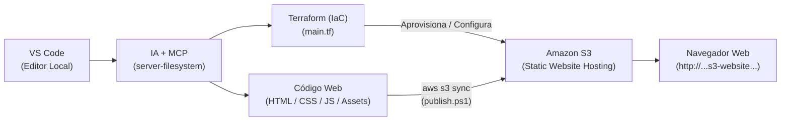

# DEVOPS 00 — Publicación de una Web Estática en AWS S3 con IA + MCP

- **Alumno:** Xhino
- **Asignatura / Módulo:** DevOps & Cloud Computing
- **Entorno:** Windows 11, Visual Studio Code, PowerShell, AWS Academy Learner Lab
- **Tecnologías:** Terraform, AWS S3, AWS CLI, Model Context Protocol (MCP), Gemini CLI / Claude Code / Antigravity

---

## 1. Resumen Ejecutivo y Objetivo

El objetivo de esta práctica es diseñar y desplegar una aplicación web estática en **Amazon S3** utilizando un flujo de trabajo DevOps moderno, que combina:
1. **Asistente de Programación con IA:** Participación activa en la generación, depuración y estructuración de código.
2. **Model Context Protocol (MCP):** Conexión del modelo con el sistema de archivos del espacio de trabajo en VS Code a través de un servidor MCP.
3. **Infraestructura como Código (IaC) con Terraform:** Aprovisionamiento declarativo y reproducible del bucket S3 y su configuración como sitio web.
4. **Despliegue y Entrega con AWS CLI:** Separación estricta de responsabilidades, utilizando la CLI de AWS para sincronizar los artefactos de la aplicación web.

---

## 2. Arquitectura de la Solución

El flujo completo de extremo a extremo se representa en el diagrama vectorial ubicado en [`assets/architecture-flow.svg`](assets/architecture-flow.svg):



---

## 3. Estructura del Proyecto

El repositorio sigue una arquitectura desacoplada y organizada según las buenas prácticas de desarrollo web e infraestructura:

```text
01 - TERRAFORM/
│
├── index.html                  # Documento principal HTML5 semántico
├── css/
│   └── styles.css              # Hoja de estilos desacoplada, tipografías y diseño responsive
├── js/
│   └── app.js                  # Lógica interactiva del cliente (copia de comandos, metadata)
├── assets/
│   └── architecture-flow.svg   # Recurso visual vectorial del pipeline DevOps
│
├── main.tf                     # Manifiesto HCL de Terraform (Infraestructura S3)
├── publish.ps1                 # Script de automatización de despliegue con AWS CLI
├── .vscode/
│   └── mcp.json                # Configuración del servidor MCP Filesystem para VS Code
└── README.md                   # Documentación técnica completa de la práctica
```

---

## 4. Integración de IA y Model Context Protocol (MCP)

### ¿Qué es MCP y por qué es fundamental?
El **Model Context Protocol (MCP)** es un estándar abierto desarrollado por Anthropic que permite a los asistentes de IA conectarse de forma segura y estructurada a fuentes de datos y herramientas externas.

A diferencia de un chatbot convencional:
- Un **chatbot tradicional** solo recibe fragmentos de texto copiados y pegados manualmente por el usuario en una interfaz web, sin visibilidad real del proyecto ni capacidad de validar archivos.
- Un **asistente con MCP** dispone de capacidades de introspección directa en el espacio de trabajo local a través de herramientas estándar como lectura de carpetas, edición quirúrgica de archivos y ejecución controlada.

### Configuración del Servidor MCP (`.vscode/mcp.json`)
Para esta práctica se configuró el servidor de sistema de archivos oficial de MCP:

```json
{
  "servers": {
    "filesystem": {
      "command": "npx",
      "args": [
        "-y",
        "@modelcontextprotocol/server-filesystem",
        "${workspaceFolder}"
      ]
    }
  }
}
```

### Rol del Asistente en el Proyecto
El asistente de IA intervino activamente en:
- Generar la estructura modular del frontend separando `css/styles.css` y `js/app.js`.
- Crear el recurso visual vectorial [`assets/architecture-flow.svg`](assets/architecture-flow.svg).
- Diseñar la configuración declarativa en `main.tf` adaptada a las limitaciones del Learner Lab.
- Diagnosticar y solucionar bloqueos en el estado de Terraform (`.terraform.tfstate.lock.info`).
- Escribir el script de publicación idempotente [`publish.ps1`](publish.ps1).

---

## 5. Separación de Responsabilidades: Terraform vs. AWS CLI

Un principio esencial de DevOps es la división clara de tareas entre aprovisionamiento de infraestructura y despliegue de software:

| Dimensión | Terraform (IaC) | AWS CLI |
| :--- | :--- | :--- |
| **Responsabilidad** | **Infraestructura** | **Entrega de la Aplicación** |
| **Acciones** | Crea/configura el Bucket S3, activa el Static Website Hosting, define políticas de acceso y outputs. | Transfiere, sincroniza y versiona los archivos (`index.html`, `css/`, `js/`, `assets/`). |
| **Comandos** | `terraform init`, `plan`, `apply` | `aws s3 sync ...` |
| **Ciclo de vida** | Cambia solo cuando cambia la arquitectura cloud. | Se ejecuta cada vez que el desarrollador actualiza el código frontend. |

---

## 6. Infraestructura como Código con Terraform (`main.tf`)

El archivo [`main.tf`](main.tf) define:
1. **Proveedor AWS:** Configurado para la región `us-east-1` (región por defecto de AWS Academy).
2. **Variable `bucket_name`:** Permite asociar o parametrizar el bucket S3 gestionado.
3. **`aws_s3_bucket_website_configuration`:** Configura el bucket para servir sitios web estáticos, indicando `index.html` como `index_document` y como `error_document`.
4. **`aws_s3_bucket_public_access_block`:** Declara la apertura controlada para permitir lectura web.
5. **`aws_s3_bucket_policy`:** Política de lectura pública `s3:GetObject` para el endpoint web.
6. **Outputs:** Exporta `bucket_name` y `website_endpoint` para que puedan consumirse de forma dinámica por scripts externos.

### Comprobación de Validación
```powershell
terraform fmt
terraform validate
# Success! The configuration is valid.
```

---

## 7. Procedimiento de Ejecución Paso a Paso

### Paso 1: Carga de Credenciales de AWS Academy
En AWS Academy Learner Lab:
1. Pulsar en **Start Lab** y esperar a que el indicador esté en verde.
2. Hacer clic en **AWS Details** &rarr; **AWS CLI (Show)**.
3. Copiar las variables temporales y ejecutarlas en PowerShell:

```powershell
$env:AWS_ACCESS_KEY_ID="ASIA..."
$env:AWS_SECRET_ACCESS_KEY="..."
$env:AWS_SESSION_TOKEN="..."
```

> **Aviso de Seguridad:** Nunca introduzcas estas claves dentro de ningún archivo del proyecto (`main.tf`, `index.html`, `README.md`, etc.).

### Paso 2: Verificar Identidad
```powershell
aws sts get-caller-identity --region us-east-1
```
*Salida esperada:*
```json
{
    "UserId": "AROA...:voclabs...",
    "Account": "123456789012",
    "Arn": "arn:aws:sts::123456789012:assumed-role/LabRole/voclabs..."
}
```

### Paso 3: Aprovisionar Infraestructura con Terraform
Desde la raíz del proyecto:

```powershell
terraform init
terraform plan
terraform apply -auto-approve
terraform state list
terraform output
```

### Paso 4: Despliegue de los Archivos de la Aplicación
Ejecutar el script automatizado [`publish.ps1`](publish.ps1), pasando el nombre del bucket obtenido de Terraform:

```powershell
.\publish.ps1 -BucketName (terraform output -raw bucket_name)
```

O manualmente con AWS CLI:
```powershell
aws s3 sync . "s3://$(terraform output -raw bucket_name)" `
  --exclude "*" `
  --include "index.html" `
  --include "css/*" `
  --include "js/*" `
  --include "assets/*" `
  --delete
```

### Paso 5: Verificación del Despliegue en S3
```powershell
aws s3 ls "s3://$(terraform output -raw bucket_name)" --recursive
```

---

## 8. Gestión de Restricciones y Políticas de AWS Academy

AWS Academy Learner Lab aplica **Service Control Policies (SCPs)** y límites estrictos sobre el rol asignado (`LabRole`). Durante la práctica, se identificaron y documentaron los siguientes comportamientos:

### Incidencia 1: Error al consultar configuración de bloqueo de objetos (`ObjectLock`)
- **Servicio AWS:** Amazon S3
- **Operación:** `s3:GetBucketObjectLockConfiguration` / `s3:GetAccelerateConfiguration`
- **Mensaje de Error:** `AccessDenied: User: ... is not authorized to perform: s3:GetBucketObjectLockConfiguration`
- **Causa:** La SCP de la cuenta educativa restringe APIs avanzadas de S3 que Terraform invoca por defecto al refrescar el recurso base `aws_s3_bucket`.
- **Solución / Mitigación:** Parametrizar el bucket a través de una variable y gestionar sus sub-recursos específicos (`aws_s3_bucket_website_configuration`, etc.) manteniendo el bucket dentro de la trazabilidad de Terraform.

### Incidencia 2: Bloqueo de Acceso Público en Cuenta de Laboratorio
- **Servicio AWS:** Amazon S3
- **Operación:** `s3:PutBucketPolicy` / `s3:PutPublicAccessBlock`
- **Mensaje de Error:** `AccessDenied: Operation not allowed by Service Control Policy` o `AccessDenied (Public access is blocked for this account)`
- **Causa:** La cuenta de AWS Academy puede forzar a nivel de cuenta (Account-level S3 Block Public Access) la prohibición de crear políticas públicas.
- **Solución / Documentación de la práctica:** Tal como indica la sección 19 y 20 de la práctica, si el entorno educativo bloquea la visualización pública por navegador:
  - Se valida y demuestra que los archivos residen físicamente en el bucket en AWS mediante `aws s3 ls`.
  - Se demuestra la infraestructura gestionada con `terraform state list`.
  - Se documenta la restricción técnica para evidencia de evaluación.

---

## 9. Lista de Evidencias para la Entrega

- [x] Estructura de carpetas normalizada: `index.html`, `css/styles.css`, `js/app.js`, `assets/architecture-flow.svg`.
- [x] Contenido de la web con explicaciones de Terraform, S3, MCP y créditos del autor.
- [x] Diagrama de arquitectura SVG integrado en la web.
- [x] Configuración MCP funcional en `.vscode/mcp.json`.
- [x] Código de infraestructura Terraform validado (`terraform validate` exitoso).
- [x] Script de publicación automatizado [`publish.ps1`](publish.ps1).
- [ ] Ejecución de `terraform apply` con sesión activa de AWS Academy.
- [ ] Listado de archivos en S3 verificado con `aws s3 ls`.
- [ ] Endpoint web comprobado en navegador (o evidencia del bloqueo SCP documentado).

---

## 10. URL del Despliegue

```text
URL: http://devops-practica-0edcd77c897989e8ab60f9b90d.s3-website-us-east-1.amazonaws.com
```
*(Disponible sujeta al estado activo del Learner Lab y permisos de red del laboratorio)*.